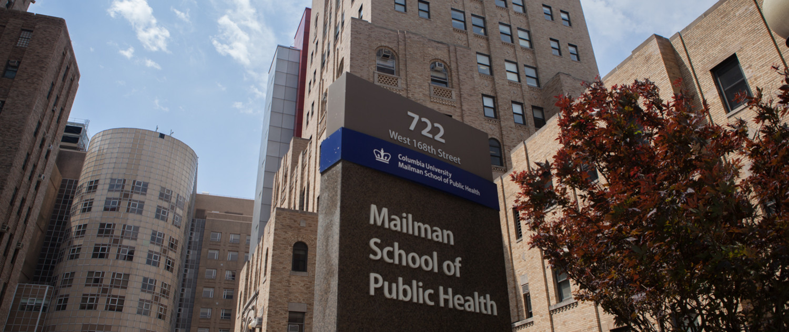

# **Hello there!**

My name is Clayton Snyder.

I'm 27 years old, quickling reaching 28. I was born and raised in Brooklyn, New York. After a brief stint as an ex-patriot (in Montreal, Canada) I ended up moving back to my hometown of Brooklyn.

I enjoy watching movies (especially documentaries and horror), playing video games, basketball, billiards, and I listen to all genres of music ([Khruangbin](https://khruangbin.bandcamp.com/) being my current favorite). 

I absolutely love pizza, and being from Brooklyn I have strong opinions about where to find the best pizza (it's [here](https://www.difarapizzany.com/)). 

I am currently in school for an MPH in Biostatistics at Columbia University, which is going so far so good!

If you want, you can learn more about my educational and professional experiences [here](about.html)

